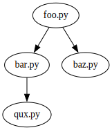
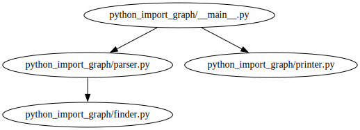

# python-import-graph

Show the local import graph given a Python source file and directory.

*In more detail:* Visualize the import relation defined between the
Python source files located in a common base directory from the
perspective of one of these source files.


## Install

```sh
$ pip install git+https://github.com/newskylabs/python-import-graph
```

## Uninstall

```sh
$ pip uninstall python-import-graph
```

## Usage

#### Print import relation as indented list

- Change into the base directory of the source file directory tree:
  `cd <basedir>`
- run `python-import-graph` on a source file `<file>` in this tree:
  `python-import-graph <file>`
- an indented list representation of the import relation defined on
  the source files starting from `<file>` is printed.


#### Visualize import relation as directed graph

- When the `--dot` option is used, the import relation is represented
  in [Graphviz](https://www.graphviz.org/)'s DOT language and can be
  visualized as a directed graph via the `dot` comand:
  `python-import-graph --dot <file> | dot -Tsvg > import-graph.svg`


## Help

```sh
% python-import-graph --help

Usage: python-import-graph [OPTIONS] FILENAME

  Show the local import graph given a Python source file and directory.

Options:
  --dot   Print graph in graphviz dot format.
  --help  Show this message and exit.
```


## Examples

### Example 1

Given are the following source files:

```txt
~/sourcedir
├── foo.py
├── bar.py
├── baz.py
└── qux.py
```

The import relation is defined as follows:

- `foo.py` imports functionality from `bar.py` and `baz.py`;
- `bar.py` imports functionality from `qux.py`.


#### Print import relation as indented list

We can visualize the import relation as indented list by running
`python-import-graph` on `foo.py` from the source file directory
`~/sourcedir`:

```sh
$ cd ~/sourcedir
$ python-import-graph foo.py

foo.py
  bar.py
  baz.py

bar.py
  qux.py

qux.py

baz.py

```


#### Visualize import relation as directed graph

Using the `--dot` option we can print the import relation in DOT
language as defined by [Graphviz](https://www.graphviz.org/):

```sh
$ python-import-graph --dot foo.py

digraph {
  "foo.py" -> {
    "bar.py"
    "baz.py"
  }
  "bar.py" -> {
    "qux.py"
  }
  "qux.py" -> {
  }
  "baz.py" -> {
  }
}
```

Via the dot command this representation can be rendered as an image:

```sh
$ python-import-graph --dot foo.py | dot -Tsvg > import-graph.svg
$ open -a 'Google Chrome' import-graph.svg
```

The following image is the result:




### Example 2

This time we apply `python-import-graph` to its own sources.

First we clone the git repository:

```sh
$ git clone https://github.com/newskylabs/python-import-graph
$ ls -1 python-import-graph

README.md
pdm.lock
pyproject.toml
src/
```

The `src` directory has the following structure:

```sh
$ tree python-import-graph/src

python-import-graph/src
└── python_import_graph
    ├── __init__.py
    ├── __main__.py
    ├── finder.py
    ├── parser.py
    └── printer.py
```


#### Print import relation as indented list

The main file of the `python-import-graph` tool is
`python_import_graph/__main__.py`.  We change into the source file
base directory `python-import-graph/src` and run `python-import-graph`
on `python_import_graph/__main__.py` to visualize the import relation
seen from `python_import_graph/__main__.py` as indented list:

```sh
$ cd python-import-graph/src
$ python-import-graph python_import_graph/__main__.py

python_import_graph/__main__.py
  python_import_graph/parser.py
  python_import_graph/printer.py

python_import_graph/parser.py
  python_import_graph/finder.py

python_import_graph/finder.py

python_import_graph/printer.py

```

#### Visualize import relation as directed graph

In the same way as shown in *Example 1* we can visualize the import
relation in form of a directed graph:

```sh
$ python-import-graph --dot python_import_graph/__main__.py | dot -Tpng > import-graph2.png
$ open import-graph.png
```

An image like the following is the result:




#### The actual import statements

Inspecting the actual source files reveals how this relation is
defined via import statements:

`src/python_import_graph/__main__.py` imports functionality from
`python_import_graph.parser` and `python_import_graph.printer` defined
in the files `python_import_graph/parser.py` and
`python_import_graph/printer.py` respectively:

```python
from python_import_graph.parser import calculate_import_graph

from python_import_graph.printer import (
    print_in_graphviz_dot_format,
    print_as_indented_list,
)
```

And `src/python_import_graph/parser.py` imports functionality from
`python_import_graph.finder`, which is defined in the file
`python_import_graph/finder.py`:

```python
from python_import_graph.finder import find_imported_file
```

